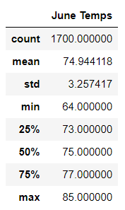
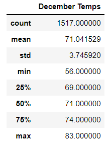

# Surf's Up: Climate Analysis
## Project Overview
- This analysis project provides a visualizatoin of the temperature trends in Oahu for the purpose of having a potential investor to invest in a surf shop in Oahu. 
-  Temperature data for the months of June and December were analyzed in this project.

    
##  Results

- The average temperature in June is about 75 degrees Fahrenheit.
- The average temperature in December is about 71 degrees Fahrenheit.
- Based on the analysis, temperature year-around in Oahu stays mostly in the 70s.

## Summary and Recommendations
- Overall, the temperatures in Oahu are moderate all year-around, making the location a perfect spot for tourists trying to escape harsh Winters or Summers where they are from.
- Additional analysis on the precipitation and temperature among weather stations (with data on the location of each weather station) would also benefit the investor, feeling confident that the shop would be in the optimal location on the island based on the climate.